# Project Overview and Architecture

## Project Summary

(From project_summary_readme.txt)

The project is a sophisticated Solana-based arbitrage bot designed to identify and execute profitable multi-hop arbitrage opportunities across various Decentralized Exchanges (DEXs). The core strategy involves finding complex paths (2-4 hops) and executing them as atomic batch transactions to maximize profit, ensure execution, and optimize gas fees. The system is built for high performance, scalability, and robust risk management, with a long-term vision of AI-enabled self-optimization.

### Architecture

The system is designed with a layered and modular architecture:

- **arbitrage**: Central arbitrage logic, including the ArbitrageEngine, OpportunityDetector, AdvancedPathFinder, calculation utilities, and the AdvancedBatchExecutor for atomic transaction execution.
- **dex**: Implements clients for various DEXs (Orca, Raydium, Meteora, Lifinity, and now Jupiter). Defines a common DexClient trait for standardized interaction and includes pool data structures and a PoolDiscovery service.
- **solana**: Handles direct interactions with the Solana blockchain, featuring an RPC client (with failover capabilities) and WebSocket clients for real-time data streams.
- **config**: Manages system configuration, typically loaded from environment variables or configuration files.
- **websocket**: Manages WebSocket connections for live price and pool updates from DEXs.
- **cache**: Integrates a caching layer (e.g., Redis) to store frequently accessed data like pool states or token information, reducing latency and API load.
- **metrics**: Collects and exposes performance metrics.
- **paper_trading**: Provides a simulation engine to test strategies without real funds.
- **safety**: Implements risk management features like circuit breakers and balance monitoring.
- **helius_client**: Manages interactions with Helius APIs for services like transaction monitoring via webhooks.
- **utils**: Contains shared utilities and helper functions used across the codebase.

#### Architectural Layers (Conceptual)

- **Market Intelligence**: Real-time data from DEXs via WebSockets, managing pool states efficiently, enabling rapid price discovery. ML-powered opportunity prediction is a future goal.
- **Opportunity Detection**: AdvancedPathFinder discovers multi-hop arbitrage paths, applies filters for liquidity, slippage, and profitability, and scores opportunities.
- **Execution Engine**: AdvancedBatchExecutor groups opportunities into atomic transactions, manages potential conflicts, optimizes gas, and includes MEV protection strategies.
- **Risk Management & Optimization**: Dynamic profit thresholds, intelligent capital allocation, real-time slippage protection, and emergency systems like circuit breakers.

#### Execution Flow

- Data Collection & Pool Management: Real-time price and pool data is ingested from multiple DEXs via WebSocket streams. DEX-specific clients fetch and parse detailed pool information. A central PoolDiscovery service identifies and maintains an up-to-date map of tradable pools, often cached for quick access.
- Opportunity Identification: ArbitrageEngine orchestrates the detection process. AdvancedPathFinder analyzes the live pool data to find potential multi-hop arbitrage opportunities across configured DEXs. Calculations account for token prices, pool liquidity, DEX fees, estimated transaction (gas) fees, and potential slippage.
- Profitability Analysis & Risk Assessment: Identified paths are evaluated for profitability against configured thresholds. Risk parameters (e.g., slippage tolerance, maximum capital allocation per trade) are checked.
- Transaction Batching & Execution: Profitable and low-risk opportunities are queued. AdvancedBatchExecutor groups compatible opportunities into single atomic transactions to guarantee execution of all legs or none, and to save on gas fees. Swap instructions are generated using the DexClient trait methods for each DEX involved in the path. The batched transaction is signed and submitted to the Solana network via the RPC client.
- Monitoring & Post-Execution: Transaction status is monitored (e.g., via Helius webhooks or direct RPC polling). Balances are updated, and P&L is tracked. Metrics related to detected opportunities, executed trades, profitability, and system performance are recorded. The system continuously adapts to market conditions and its own performance.

---

## Enhanced Arbitrage Bot Startup Summary

(From Arbitrage_bot_summary.md)

Enhanced Arbitrage Bot Startup Summary
Based on the detailed startup logs from paper_trading_20250617_151200.log, here's a comprehensive review of the enhanced arbitrage bot's initialization process:

- System Overview: Solana Arbitrage Bot v2.1.4 - Modern Real-Time Architecture
- Mode: Paper Trading (Virtual Portfolio) for safe testing
- Total Startup Time: ~57 seconds
- Configuration: Successfully loaded from .env.paper-trading
- Network Configuration: Primary RPC: QuikNode mainnet endpoint with WebSocket support
- Enhanced Logging: Beautiful, structured logging with emoji indicators
- Redis Integration: ConnectionManager initialized (TTL: 60s)
- DEX Client Initialization (All 5 Successfully Loaded)
- Health Check Results: Orca, Raydium, Meteora, Lifinity, Jupiter
- Pool Discovery Process: 15,135 pools discovered
- Hot Cache System: Sub-millisecond lookups enabled
- Real-Time Architecture: LiveUpdateManager, Channel Buffer, Max Rate, Batching
- Webhook Integration: Disabled in this configuration
- Arbitrage Engine Configuration: Hot Cache Integration, DEX Providers, Batch Execution, Advanced Metrics, Paper Trading
- Performance Parameters: Detection Frequency, Min Profit Threshold, Max Slippage, Priority Fee, Pool Refresh, Health Check Interval, Status Reports
- Operational Status: All Systems Operational
- Modern webhook-driven architecture, Hot cache with sub-millisecond access, Real-time data processing pipeline, Comprehensive health monitoring
- Performance tracking every 10 seconds, Safe paper trading environment
- Active Trading Loop: Market Graph, Detection Speed, Pool Analysis, Opportunity Detection
- Key Improvements Over Basic Version: Massive Pool Coverage, Real-Time Architecture, Hot Cache System, Enhanced Logging, Comprehensive Health Monitoring, Modern Async Pipeline

The enhanced arbitrage bot has successfully initialized with a modern, production-ready architecture featuring comprehensive DEX coverage, real-time data processing, and robust monitoring systems. All 5 DEX clients are healthy and operational, with an impressive 15,135+ pools being monitored for arbitrage opportunities at 10 Hz frequency.

---

## Architecture Flow Diagram

(From architecture/arbitrage_flow.txt)

```mermaid
flowchart LR
    WS[WebSocket Feed] --> PoolMap[Live Pool Data]
    PoolMap --> Filter[Pair Blacklist / TempBan Filter]
    Filter -->|valid pairs| Calc[calculator.rs]
    Filter -->|valid pairs| Fee[fee_manager.rs]
    Calc --> Detector[🚨 Opportunity Detector]
    Fee --> Detector
    Detector -->|if profitable| Exec[executor.rs]
    Detector -->|else| Skip[discard]
```

---

## Technical Foundations

(From project_summary_readme.txt, continued)

- Asynchronous Programming: Leverages Rust's async/await and the Tokio runtime extensively for non-blocking I/O operations, crucial for handling numerous WebSocket streams and API calls concurrently.
- Modularity & Abstraction: The codebase is divided into well-defined modules. Traits like DexClient and PoolParser provide abstractions for interacting with different DEXs and parsing data uniformly.
- Concurrency and Thread Safety: Utilizes Rust's ownership model along with synchronization primitives like Arc, Mutex, and RwLock to manage shared state safely in a multi-threaded/asynchronous environment.
- Configuration-Driven: System parameters (API keys, RPC URLs, trading thresholds, feature flags) are managed externally through configuration files or environment variables, allowing flexibility without code changes.
- Robust Error Handling: Emphasizes the use of Rust's Result type for explicit error management, aiming to avoid panics (unwrap()) in production code.
- Comprehensive Testing: A strong focus on testing, including unit tests, integration tests (often with mock environments), and end-to-end tests. Paper trading serves as a critical real-world simulation test.
- Detailed Logging: Structured and configurable logging is implemented throughout the application for debugging, monitoring, and auditing purposes.
- Caching Strategies: Employs caching (e.g., Redis) for frequently accessed, relatively static data to improve performance and reduce external API calls.
- Production Readiness: Significant attention is paid to features essential for stable production deployment, including dynamic fee estimation, advanced slippage control, circuit breakers, real-time balance synchronization, API rate limiting, and security best practices (e.g., secure key management).
- Iterative Development: The project appears to evolve through defined phases, incrementally adding features and refining existing ones.
